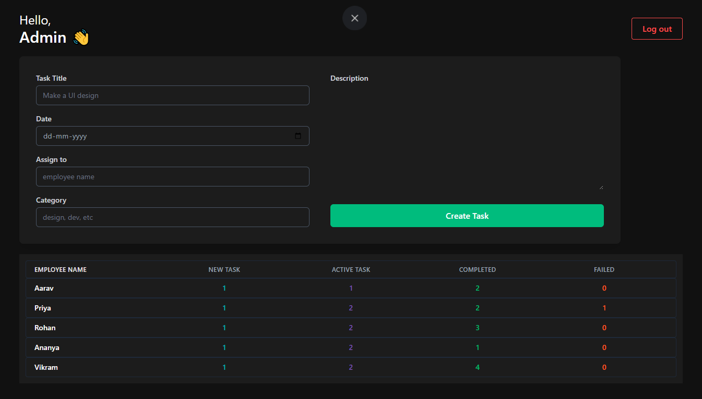
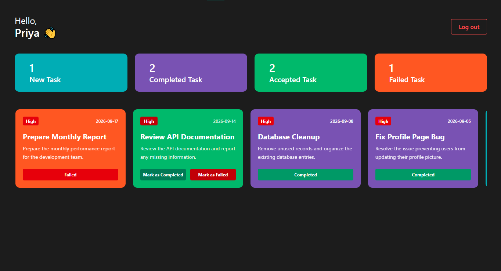
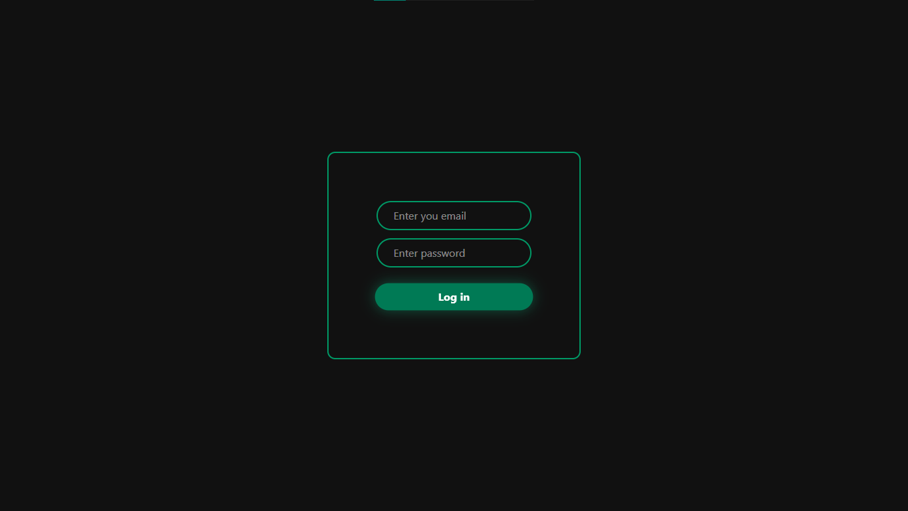

# Employee Management System 🚀

A modern Employee Management System built with React where admins can seamlessly assign tasks to employees, and employees can track their progress through a dedicated dashboard.

## 🔗 Live Demo

Check out the live application here: **[Employee Management System](https://employ-management-system-roan.vercel.app/)**

## 📸 Screenshots

|                    Admin Dashboard                     |                  Employee Dashboard                  |
| :----------------------------------------------------: | :--------------------------------------------------: |
|          |  |
| _Admin view: Assign tasks and monitor employee stats._ |   _Employee view: Track task status and numbers._    |

|                  Login Page                   |
| :-------------------------------------------: |
|           |
| _Secure login for both Admins and Employees._ |

## ✨ Features

- **Role-Based Access:** Multiple login portals and distinct dashboards for Admins and Employees.
- **Task Assignment:** Admins can create and assign tasks to specific employees.
- **Real-time Updates:** Newly assigned tasks instantly appear on the respective employee's dashboard.
- **Task Tracking:** Employees can view task details, track task numbers, and manage task cards (New, Active, Completed, Failed).
- **Persistent Data:** Uses Local Storage to simulate a database, ensuring data persists across page refreshes.

## 🛠️ Tech Stack

- **Frontend:** React, TailwindCSS, Vite
- **State Management:** React Context API
- **Routing:** React Router
- **Storage:** Local Storage (Browser-based DB)

## 📂 Folder Structure

```text
├── .gitignore
├── README.md
├── eslint.config.js
├── index.html
├── package-lock.json
├── package.json
├── vite.config.js
└── src
    ├── App.jsx
    ├── index.css
    ├── main.jsx
    ├── components
    │   ├── auth
    │   │   └── Login.jsx
    │   ├── dashboard
    │   │   ├── AdminDashboard.jsx
    │   │   └── EmployeDashboard.jsx
    │   ├── other
    │   │   ├── AllTasks.jsx
    │   │   ├── CreateTask.jsx
    │   │   ├── Header.jsx
    │   │   ├── HeaderAdmin.jsx
    │   │   └── TaskListNums.jsx
    │   └── tasklist
    │       ├── AcceptTask.jsx
    │       ├── CompleteTask.jsx
    │       ├── FaildTask.jsx
    │       ├── NewTask.jsx
    │       └── TaskList.jsx
    ├── context
    │   └── AuthProvider.jsx
    └── utils
        └── LocalStorage.jsx
```

## 🚀 Installation

Follow these steps to set up the project locally on your machine.

1. **Clone the repository**

   ```bash
   git clone https://github.com/Sanjudayal/employ-management-system.git
   ```

2. **Navigate into the directory**

   ```bash
   cd employ-management-system
   ```

3. **Install dependencies**

   ```bash
   npm install
   ```

4. **Run the development server**

   ```bash
   npm run dev
   ```

5. **Open your browser**
   Navigate to `http://localhost:5173` to view the app.

## 💻 Usage

1. **Login:** Use the login page to sign in. (Since this uses Local Storage, you may need to register or use pre-set credentials if configured, or simply log in as Admin/Employee depending on the logic implemented).
2. **Admin Flow:**
   - Fill out the "Create Task" form (Title, Date, Assignee, Category, Description).
   - Click "Create Task" to push it to the employee's list.
   - Monitor the table at the bottom to see task counts per employee.
3. **Employee Flow:**
   - View the top cards for a quick summary (New, Completed, Accepted, Failed).
   - Scroll down to see individual task cards.

## 🧠 What I Learned

Building this project helped me solidify several core React concepts:

- **Context API:** Used to centralize data and avoid prop drilling, making state management across different dashboards much cleaner.
- **Conditional Rendering:** Handling different login states and rendering specific UIs (Admin vs. Employee) based on user roles.
- **State Persistence:** Implementing Local Storage to simulate a backend database.
- **Complex State Updates:** Managing the logic where an Admin's action directly impacts an Employee's view.

## ⚠️ Challenges Faced

The most complex aspect of this project was **data synchronization**. Specifically, ensuring that when an Admin assigns a task to an employee, that task is correctly added to the `localStorage`, appended to the specific employee's task list array, and immediately reflected on the Employee's dashboard upon their next login or real-time update. Handling this relationship without a real backend required careful structuring of the data objects in the Context Provider.

## 🔮 Future Improvements

- [ ] **Backend Integration:** Replace Local Storage with a real database (e.g., Firebase, MongoDB) and API.
- [ ] **Authentication:** Implement JWT or OAuth for secure authentication.
- [ ] **Notifications:** Add toast notifications for task assignments and status changes.
- [ ] **Search & Filter:** Allow admins to filter tasks by employee or category.
- [ ] **Responsive Design:** Further optimize the UI for mobile devices.

## 🤝 Contributing

Contributions are welcome! If you have suggestions for improvements, please fork the repo and create a pull request.

1. Fork the Project
2. Create your Feature Branch (`git checkout -b feature/AmazingFeature`)
3. Commit your Changes (`git commit -m 'Add some AmazingFeature'`)
4. Push to the Branch (`git push origin feature/AmazingFeature`)
5. Open a Pull Request

## 📄 License

Distributed under the MIT License. See `LICENSE` for more information.

## 📧 Contact

**Sanju Dayal**

- GitHub: [@Sanjudayal](https://github.com/Sanjudayal)
- Project Link: [https://github.com/Sanjudayal/employ-management-system](https://github.com/Sanjudayal/employ-management-system)

- LinkedIn: https://www.linkedin.com/in/sanjudayal/

---

_Made with ❤️ using React & Tailwind CSS_
